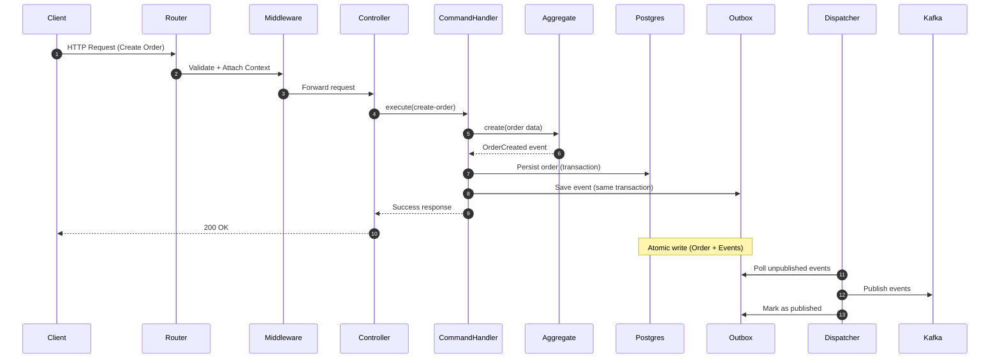
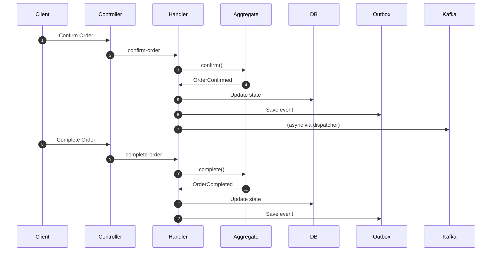
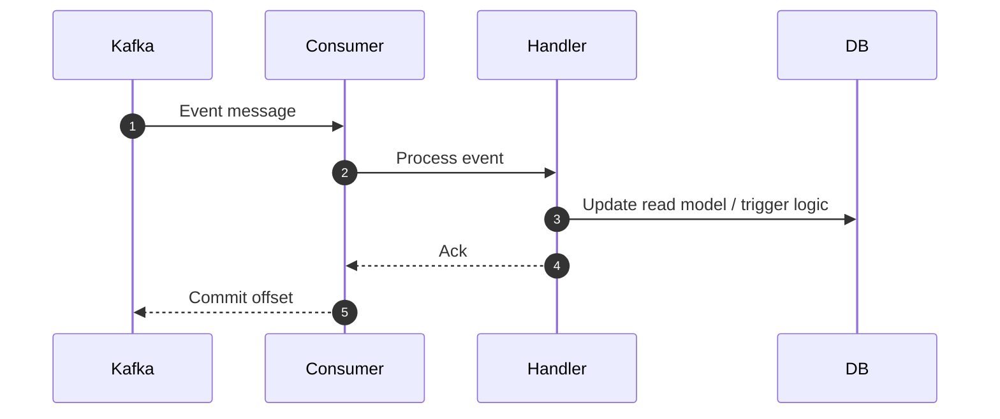

# Order Service


This service implements order management for RMS using a Domain-Driven Design approach with CQRS and event-driven communication.

Write operations are handled through command handlers, while integration with other services is achieved through Kafka using the outbox pattern for reliability.

---


### Core Patterns

* Domain-Driven Design (DDD)
* Command Query Responsibility Segregation (CQRS)
* Event-driven architecture
* Outbox pattern

---


## Domain Layer

### Aggregate

* order.aggregate.js
  Encapsulates order state and business logic.

### Entities

* order-item.entity.js
  Represents items inside an order.

### Lifecycle

* order.lifecycle.js
  Defines valid state transitions:

  * Created, Confirmed, Completed

### Invariants

* invariants.js
  Enforces domain rules and constraints.

---

## Application Layer (Commands)

### Implemented Commands

* create-order
* add-order-items
* confirm-order
* complete-order

Each command handler:

* Validates input
* Loads aggregate
* Executes domain logic
* Persists state
* Emits events

---

## Events

### Event Definitions

* order-created
* order-items-added
* order-confirmed
* order-completed

Events are written to the outbox and later published to Kafka.

---

## Outbox Pattern

### Components

* outbox.repository.js
* outbox.publisher.js
* outbox-dispatcher.job.js

### Behavior

* Events are stored in the database
* Dispatcher reads and publishes to Kafka
* Ensures atomicity and no event loss

---

## Event Consumers

Kafka consumers implemented:

* kitchen-queue.consumer
* reception-queue.consumer
* session-orders.consumer
* order-detail.consumer
* completed-orders.consumer

All extend:

* base-consumer.js

Responsibilities:

* Consume Kafka topics
* Process events
* Update downstream state or trigger workflows

---

## HTTP Layer

### Controllers

* command.controller.js
* command2.controller.js
* query.controller.js

### Middleware

* validate.js / validate-params.js
* auth-context.js
* command-metadata.js
* request-id.js

### Schemas

* command.schemas.js
* query.schemas.js

---

## Infrastructure

### PostgreSQL

* Connection pooling
* Transaction management
* Error handling
* Health checks

Used for:

* Order persistence
* Outbox storage

---

### Kafka

* Producer setup
* Consumer setup
* Client configuration
* Health checks

Used for:

* Event publishing
* Event consumption

---

## Dependency Injection

Defined in container/:

* container.js
* createRepositories.js
* createHandlers.js
* createEvents.js
* createInfra.js
* createHttp.js

Responsible for wiring all layers together.

---

## Execution Flow

### Command Flow

1. HTTP request enters router
2. Middleware validates and enriches request
3. Controller invokes command handler
4. Handler executes domain logic via aggregate
5. Order and events are stored in a single transaction
6. Dispatcher publishes events to Kafka

---

## Sequence Diagrams

### Command Flow (Create Order - Outbox - Kafka)



---

### Order Lifecycle Flow



---

### Event Consumption Flow



---

## Implementations

* Order lifecycle management
* Order item handling
* Aggregate-based domain logic
* Command handlers for all operations
* Event definitions and emission
* Outbox pattern with dispatcher
* Kafka producers and consumers
* PostgreSQL persistence with transactions
* HTTP API layer with validation and middleware
* Dependency injection container

---

## Running the Service

Environment configurations:

* .env.development
* .env.staging
* .env.production

Entry point:

```
src/server.js
```

---

